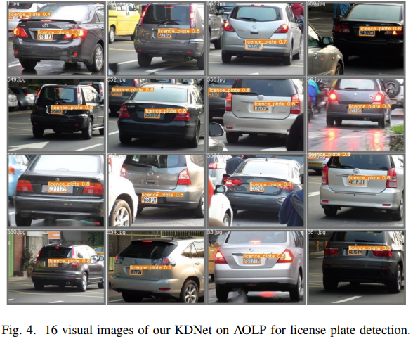

# KDNet
## Knowledge Distillation with Fast CNN for License Plate Detection (KDNet) is conducted by Chunwei Tian, Xuanyu Zhang, Xu Liang, Bo Li, Yougang Sun, Shichao Zhang in 2023. It is accepted by the IEEE Transactions on Intelligent Vehicles (SCI-IF:8.2). It is implemented by Pytorch.

### Abstract
#### Deep convolutional neural networks (CNNs) with strong expressive ability have achieved impressive performances on single image super-resolution (SISR). However, their excessive amounts ofconvolutions and parameters usually consume high computational cost and more memory storagefor training a SR model, which limits their applications to SR with resource-constrained devicesin real world. To resolve these problems, we propose a lightweight enhanced SR CNN (LESRCNN) with three successive sub-blocks, an information extraction and enhancement block (IEEB), a reconstruction block (RB) and an information refinement block (IRB). Specifically, the IEEB extracts hierarchical low-resolution (LR) features and aggregates the obtained features step-by-step to increase the memory ability of the shallow layers on deep layers for SISR. To remove redundant information obtained, a heterogeneous architecture is adopted in the IEEB. After that, the RB converts low-frequency features into high-frequency features by fusing global and local features, which is complementary with the IEEB in tackling the long-term dependency problem. Finally,the IRB uses coarse high-frequency features from the RB to learn more accurate SR features and construct a SR image. The proposed LESRCNN can obtain a high-quality image by a model fordifferent scales.  Extensive experiments demonstrate that the proposed LESRCNN outperforms state-of-the-arts on SISR in terms of qualitative and quantitative evaluation. 

## Requirements (Pytorch)
#### Pytorch 1.13.1
#### Python 3.8
#### openCV for Python

## Datasets
### Training datasets
#### The training dataset CCPD is downloaded at [https://data.vision.ee.ethz.ch/cvl/DIV2K/](https://github.com/detectRecog/CCPD). 
#### The AOLP dataset is downloaded at (https://github.com/AvLab-CV/AOLP).

### Test datasets
#### The test dataset of CCPD is downloaded at [https://data.vision.ee.ethz.ch/cvl/DIV2K/](https://github.com/detectRecog/CCPD).
#### The test dataset of CLPD is downloaded at (https://github.com/wangpengnorman/CLPD_dataset).
#### The test dataset of AOLP is downloaded at (https://github.com/AvLab-CV/AOLP).

## Command
### preprocessing
### cd tools
### Split the dataset and obtain corresponding labels.

#### KDNet
#### python train_KDNet.py

#### Test with your own parameter setting or dataset in the test.py.
#### python test_ccpd.py

## 1. Network architecture of proposed KDNet.

## 2. 16 visual images of our KDNet on CCPD for license plate detection.

## 3. 16 visual images of our KDNet on CLPD for license plate detection.

## 4. 16 visual images of our KDNet on AOLP for license plate detection.

## 5. Comparisons of different datasets.

## 6. Different detection accuracy (F1) from different methods on CLPD with the IoU is 0.9 (%).

## 7. Detection accuracy (mAP) from different methods with IoU of 0.7 on CCPD (%).

## 8. Detection accuracy (F1) from different methods with IoU of 0.9 on CLPD (%).

## 9. Detection time and FPS of different methods on CCPD via 1080Ti GPU.

## If you cite this paper, plesae the follow format:

### 1. Tian, C., Zhang, X., Liang, X., Li, B., Sun, Y., & Zhang, S.. "Knowledge Distillation with Fast CNN for License Plate Detection." IEEE Transactions on Intelligent Vehicles (2023).
### 2. @article{tian2023knowledge,
  ### title={Knowledge Distillation with Fast CNN for License Plate Detection},
  ### author={Tian, Chunwei and Zhang, Xuanyu and Liang, Xu and Sun, Yougang and Zhang, Shichao},
  ### journal={IEEE Transactions on Intelligent Vehicles},
  ### year={2023}
### }
